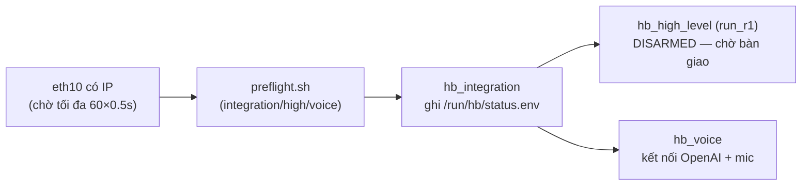

# Dịch vụ, khởi động & triển khai HB trên R1 — tài liệu chi tiết

**Liên quan:** [Sơ đồ mạng](SO_DO_MANG_R1.md) · [Phần cứng Jetson](PHAN_CUNG_JETSON_R1.md)

🌐 **Bản web:** https://claude.ai/code/artifact/309ef766-6440-47af-816f-cf8e4ce456d9 · ⚠️ File tài liệu — **không deploy lên robot**.

---

## 1. Hai tầng dịch vụ

Jetson chạy song song **firmware nhà máy Unitree** và **stack HB của bạn**.

### 1.1 Dịch vụ Unitree (nhà máy) đang chạy

`master_service`, `nxserver`, `ota_pipe`, cùng các daemon nền NVIDIA: `nvargus-daemon` (ISP camera), `nvfancontrol` (quạt), `nvphs`, `nv-tee-supplicant`, `nvs-service`, `nvpmodel`. Đây là lớp giữ robot sống; **không đụng tới**.

### 1.2 Stack HB (systemd, đều `enabled`)

Cụm gộp dưới target `hb-stack.target`:

| Service                    | Mô tả                              | Binary/Script                                             | Khởi động                                                        |
| -------------------------- | ------------------------------------ | --------------------------------------------------------- | ------------------------------------------------------------------- |
| `hb_integration.service` | Điều phối PTT & audio (read-only) | `r1_integration/build/hb_integration --interface eth10` | Sau khi eth10 có IP; xoá + ghi lại`/run/hb/status.env`         |
| `hb_high_level.service`  | Chạy policy điều khiển           | `high_level_2/build/run_r1`                             | **After** `hb_integration`; **khởi động DISARMED** |
| `hb_voice.service`       | Voice (PTT + OpenAI)                 | `r1_integration/scripts/run_voice.sh`                   | preflight`voice` rồi chạy `python -m hb_voice`                |

Tất cả: `Restart=on-failure`, `RestartSec=3–5`.

---

## 2. Thứ tự & điều kiện khởi động



Các chốt an toàn khi boot:

- **Chờ eth10 sẵn sàng:** cả `hb_integration` và `hb_high_level` có `ExecStartPre` lặp 60 lần kiểm tra `ip addr show eth10 | grep inet` trước khi chạy → không khởi động khi chưa có mạng robot.
- **preflight.sh** chặn chạy nếu thiếu điều kiện (vd `OPENAI_API_KEY` placeholder, package thiếu…).
- `hb_high_level` **After=** `hb_integration` → coordinator phải lên trước.
- `hb_integration` có `ExecStartPost` chờ `/run/hb/status.env` xuất hiện (tối đa 40×0.25s) mới coi là thành công.

---

## 3. File trạng thái runtime (đọc được, không secret)

| File                         | Do ai ghi          | Nội dung                                                                                                 |
| ---------------------------- | ------------------ | --------------------------------------------------------------------------------------------------------- |
| `/run/hb/status.env`       | `hb_integration` | `ready, high_alive, high_busy, high_armed, high_state, remote_alive, ptt, mic_allowed, speaker_allowed` |
| `/run/hb/voice_status.env` | `hb_voice`       | `state, openai_ready, mic_ready, attempt, last_reason, updated_unix`                                    |

Trạng thái lúc đo (bình thường):

```
status.env:  ready=1 high_alive=1 high_armed=0 high_state=DISARMED remote_alive=1 ptt=0 mic_allowed=0 speaker_allowed=1
voice_status.env: state=ready openai_ready=1 mic_ready=1 attempt=1 last_reason=none
```

`high_state=DISARMED` = policy **chưa cầm quyền động cơ** (an toàn khi mới bật). Cần quy trình bàn giao (remote R3-1 + thao tác high-level) để ARM.

---

## 4. Layout triển khai (deploy)

Trên robot: **`/home/unitree/HB/`** — **KHÔNG phải git repo** (đồng bộ bằng rsync từ máy dev). Gồm đúng 3 thư mục được deploy:

```
/home/unitree/HB/
├── high_level_2/      # policy runner (C++), model ONNX, config
│   ├── build/         # run_r1 (đã build trên robot)
│   ├── config/tuning.yaml
│   ├── policies/flat/ # policy_*.onnx (chính sách đi)
│   ├── policies/dance/# policy_pokemon_1.onnx (nhảy)
│   └── thirdparty/onnxruntime_aarch64, cnpy
├── r1_integration/    # coordinator (C++) + scripts systemd
│   ├── build/hb_integration
│   ├── config/model_manifest.conf
│   └── scripts/       # deploy_stack.sh, preflight.sh, health_check.sh…
└── voice_r1/          # voice runtime (Python + pipecat)
    ├── hb_voice/      # app.py, config.py, input.py, gate.py…
    ├── config/tuning.yaml, prompt.txt
    └── unitree_bridge/build/r1_bridge  # cầu mic/loa (C++)
```

### Quy trình deploy (từ máy dev, qua Tailscale/WiFi)

`r1_integration/scripts/deploy_stack.sh`:

- `diff` → rsync dry-run xem sẽ đổi gì.
- `deploy [--no-restart|--restart-voice|--accept-policy]` → **backup tar** sang `HB_backups/` → rsync 3 thư mục → `build_on_robot.sh` → `activate_services.sh` (restart service).
- `status` → chạy `health_check.sh`.
- `pull` → kéo ngược code từ robot về dev.
- `rollback` → giải nén backup mới nhất + build + activate.

Excludes khi sync: `__pycache__`, `*.pyc`, `.cache`, `logs`, `build/`, `.venv/`, `thirdparty/onnxruntime/`, `docs/`. **Các file `.md` bên trong 3 thư mục vẫn được sync**; chỉ `.md` ở gốc `HB/` (như tài liệu này) là không.

---

## 5. Chọn & xác thực model policy

`r1_integration/config/model_manifest.conf` — policy đi được **chấp nhận** hiện tại:

```
MODEL_REL=policies/flat/policy_5.onnx
MODEL_SHA256=020ff55754bb48abe4c26ae1a2f670b03e34937d435dcb4832421023a17298c2
MODEL_INPUT=83      # obs 83 chiều
MODEL_OUTPUT=24     # action 24 khớp
```

- `high_level_2/config/tuning.yaml` có `flat_model: policy_5.onnx` — **khớp** với manifest.
- Script `update_model_manifest.sh --accept` build thử `run_r1 --preflight`, tính SHA256 model, và cập nhật manifest → đảm bảo model deploy đúng là model đã kiểm.
- Kho policy sẵn có: `policies/flat/policy_{0..6,10_07,11_07,r1,r1_1}.onnx` (đi), `policies/dance/policy_pokemon_1.onnx` (nhảy).

> Obs 83 / action 24 = **chính sách đi (locomotion)**. Khác với chính sách **mimic** (obs 129) dùng cho bắt chước động tác — hai loại obs khác nhau, đừng lẫn.

---

## 6. Các "núm" tinh chỉnh high-level đáng chú ý

Trích `high_level_2/config/tuning.yaml`:

| Nhóm           | Tham số                                                                                     | Ý nghĩa                       |
| --------------- | -------------------------------------------------------------------------------------------- | ------------------------------- |
| Gains đứng    | `stand_kp_leg=200`, `stand_kp_waist=200`, `stand_kp_arm=40`, `stand_kd=3`            | Độ cứng khi đứng           |
| Scale policy    | `policy_kp_scale=1.0`, `policy_kd_scale=1.0`                                             | Nhân gain khi chạy policy     |
| Tốc độ chậm | `slow_vx=0.7 vy=0.5 yaw=1.5 vx_back=0.5`                                                   | Giới hạn lệnh khi mode chậm |
| Tốc độ nhanh | `fast_vx=1.5 vy=0.8 yaw=1.5 vx_back=0.8`                                                   | Mode nhanh                      |
| Gia/giảm tốc  | `cmd_accel_*`, `cmd_decel_*`                                                             | Làm mượt lệnh vận tốc     |
| Giữ hướng    | `heading_hold_enabled=true`, `kp=0.8`, `max_yaw=0.4`                                   | Tự giữ heading khi đi thẳng |
| Chống ngã     | `fall_enabled=true`, `fall_tilt_deg=50`, `fall_flip_tilt_deg=30`, `fall_flip_gyro=4` | Ngưỡng phát hiện ngã       |
| Bảo vệ khớp  | `joint_speed_guard_enabled=true`, `joint_speed_limit=25`                                 | Chặn khớp quay quá nhanh     |
| Timeout         | `state_timeout_ms=1000`, `remote_timeout_ms=3000`                                        | Mất state/remote thì dừng    |
| Dance           | `dance_2=xexe_1`, `dance_speed_2=1.0`                                                    | Cấu hình động tác nhảy    |

*(Danh sách rút gọn — file thật còn nhiều tham số về blend/lock/settle khi chuyển trạng thái stand↔policy↔dance.)*

---

## 7. Lệnh vận hành nhanh

```bash
# Sức khỏe toàn stack (chờ voice sẵn sàng):
bash ~/HB/r1_integration/scripts/health_check.sh --wait-voice

# Trạng thái từng service:
systemctl status hb_integration hb_high_level hb_voice --no-pager

# Log realtime:
journalctl -u hb_high_level -f      # policy
journalctl -u hb_voice -f           # voice

# Restart (cần sudo):
sudo systemctl restart hb_voice.service

# Deploy từ máy dev:
bash HB/r1_integration/scripts/deploy_stack.sh diff        # xem trước
bash HB/r1_integration/scripts/deploy_stack.sh deploy --restart-voice
```

---

*Tài liệu tạo từ dữ liệu SSH thật ngày 2026-07-24.*
