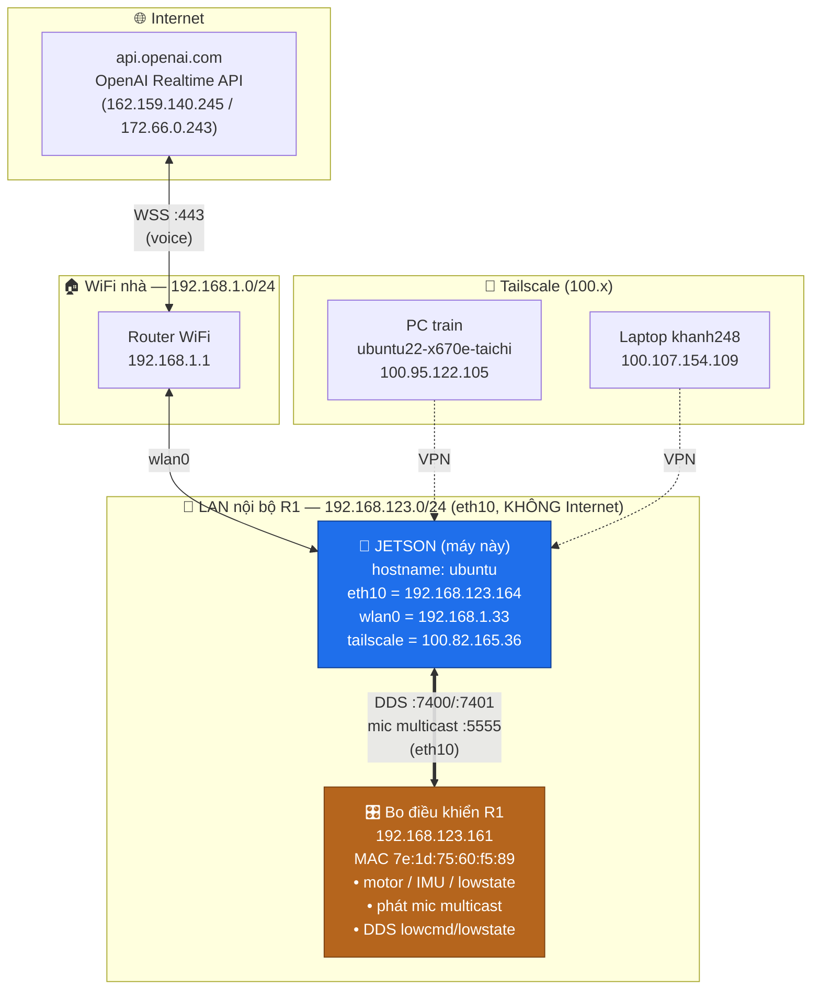
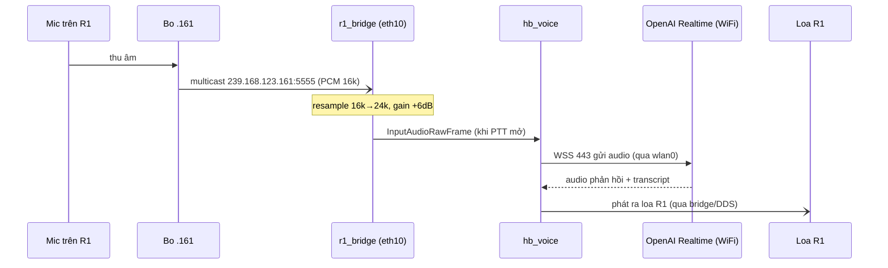
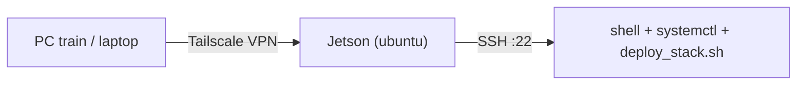

# Sơ đồ mạng & giao tiếp của robot R1 — tài liệu chi tiết

> **Mục đích:** làm tài liệu tham chiếu đầy đủ để hiểu mọi máy tính trong/quanh R1 nói chuyện với nhau thế nào.
>
> 🌐 **Bản web (sơ đồ mermaid render sẵn):** https://claude.ai/code/artifact/8140ea95-edd3-4aa1-81e8-a416dc773b02
>
> 📚 **Bộ tài liệu R1:** [Sơ đồ mạng](SO_DO_MANG_R1.md) (file này) · [Phần cứng Jetson](PHAN_CUNG_JETSON_R1.md) · [Dịch vụ &amp; deploy HB](DICH_VU_HB_STACK_R1.md)
>
> ⚠️ File này chỉ là tài liệu — **KHÔNG deploy lên robot**.

---

## Mục lục

1. [Tổng quan — 3 mặt phẳng mạng](#1-tổng-quan--3-mặt-phẳng-mạng)
2. [Phần cứng &amp; interface](#2-phần-cứng--interface)
3. [Bảng định tuyến (routing)](#3-bảng-định-tuyến-routing)
4. [Sơ đồ tổng thể](#4-sơ-đồ-tổng-thể)
5. [Các máy trên từng mạng](#5-các-máy-trên-từng-mạng)
6. [DDS — xương sống điều khiển](#6-dds--xương-sống-điều-khiển)
7. [Bảng cổng &amp; dịch vụ đầy đủ](#7-bảng-cổng--dịch-vụ-đầy-đủ)
8. [Hai tầng phần mềm trên Jetson](#8-hai-tầng-phần-mềm-trên-jetson)
9. [Luồng dữ liệu (sequence diagrams)](#9-luồng-dữ-liệu)
10. [PTT, gate &amp; remote R3-1](#10-ptt-gate--remote-r3-1)
11. [Mô hình truy cập &amp; bảo mật](#11-mô-hình-truy-cập--bảo-mật)
12. [Sự cố routing 24/7 (postmortem)](#12-sự-cố-routing-247-postmortem)
13. [Bảng chẩn đoán sự cố](#13-bảng-chẩn-đoán-sự-cố)
14. [Lệnh tự kiểm tra](#14-lệnh-tự-kiểm-tra)
15. [Thuật ngữ](#15-thuật-ngữ)
16. [Phụ lục: output thô](#16-phụ-lục-output-thô)

---

## 1. Tổng quan — 3 mặt phẳng mạng

Bộ não chính điều khiển R1 là một **Jetson (NVIDIA Tegra, ARM64, Ubuntu 20.04.5, kernel 5.10.104-tegra)**, hostname `ubuntu`. Nó cắm vào **3 mạng cùng lúc**, mỗi mạng một vai trò tách bạch:

| Mặt phẳng               | Interface      | Dải IP                                       | Vai trò                               |   Internet?   |
| ------------------------- | -------------- | --------------------------------------------- | -------------------------------------- | :-----------: |
| **LAN nội bộ R1** | `eth10`      | `192.168.123.0/24` — Jetson `.164`       | Điều khiển robot + audio (DDS, mic) | ❌ mạng cụt |
| **WiFi nhà**       | `wlan0`      | `192.168.1.0/24` — Jetson `.33`          | Ra Internet (OpenAI), vào LAN nhà    |      ✅      |
| **Tailscale VPN**   | `tailscale0` | `100.64.0.0/10` — Jetson `100.82.165.36` | Truy cập robot từ xa                 |  ✅ overlay  |

> **Nguyên tắc số 1:** một máy nhiều interface **chỉ được có ĐÚNG 1 default route**, và nó phải trỏ ra cổng thật sự có Internet (ở đây là `wlan0`). Cổng `eth10` (dây sang R1) **tuyệt đối không đặt gateway** — đặt vào là sập Internet (xem [mục 12](#12-sự-cố-routing-247-postmortem)).

---

## 2. Phần cứng & interface

Toàn bộ interface trên Jetson (`ip -br addr`):

| Interface      | Trạng thái | Địa chỉ             | Ghi chú                                                                      |
| -------------- | ------------ | ---------------------- | ----------------------------------------------------------------------------- |
| `lo`         | UNKNOWN      | `127.0.0.1/8`        | Loopback                                                                      |
| `eth10`      | **UP** | `192.168.123.164/24` | Dây Ethernet nối bo điều khiển R1; MTU 1500;`noprefixroute` (IP tĩnh) |
| `wlan0`      | **UP** | `192.168.1.33/24`    | WiFi "ASEAN 2.4GHz"; DHCP; đường ra Internet                               |
| `tailscale0` | UP           | `100.82.165.36/32`   | VPN mesh; MTU 1280                                                            |
| `eth0`       | DOWN         | —                     | Cổng Ethernet thứ 2, không dùng                                           |
| `docker0`    | DOWN         | `172.17.0.1/16`      | Bridge Docker (không có container chạy)                                    |
| `dummy0`     | DOWN         | —                     | Interface giả                                                                |

**Điểm mấu chốt:** `eth10` và `wlan0` là hai đường **vật lý riêng biệt**. Robot chỉ nói chuyện qua `eth10`; Internet chỉ đi qua `wlan0`. Nhầm lẫn hai đường này = nguồn gốc mọi lỗi mạng của stack.

---

## 3. Bảng định tuyến (routing)

Trạng thái **đúng** hiện tại (`ip route`):

```
default via 192.168.1.1 dev wlan0 proto dhcp metric 600      # ← đường ra Internet DUY NHẤT
192.168.1.0/24   dev wlan0 proto kernel scope link src 192.168.1.33   metric 600   # LAN nhà
192.168.123.0/24 dev eth10 proto kernel scope link src 192.168.123.164 metric 100  # LAN R1 (trực tiếp)
172.17.0.0/16    dev docker0 (linkdown)
169.254.0.0/16   dev docker0 (linkdown)
```

Cách kernel chọn đường:

- Gói tới `192.168.123.x` (robot) → khớp route `192.168.123.0/24 dev eth10` → đi thẳng qua **eth10**.
- Gói tới bất kỳ đâu khác (vd `api.openai.com`) → không khớp route cụ thể → dùng **default** → **wlan0** → router `192.168.1.1` → Internet.

Route `192.168.123.0/24 dev eth10` **sinh tự động từ dòng `addresses:`** trong netplan, **không cần** `gateway`. Đây là lý do bỏ gateway của eth10 mà robot vẫn liên lạc bình thường.

---

## 4. Sơ đồ tổng thể



**Đọc sơ đồ:** Jetson `.164` là trung tâm, nối 3 hướng — xuống bo `.161` để điều khiển/lấy mic (eth10), ra WiFi để gọi OpenAI (wlan0), và mở cửa cho dev từ xa (Tailscale).

---

## 5. Các máy trên từng mạng

### 5.1 LAN nội bộ R1 (`192.168.123.x`, qua eth10)

Đo bằng ping-sweep + ARP (`ip neigh show dev eth10`):

| IP                  | MAC                                     | Vai trò                                                                                                                                  |
| ------------------- | --------------------------------------- | ----------------------------------------------------------------------------------------------------------------------------------------- |
| `192.168.123.161` | `7e:1d:75:60:f5:89`                   | **Bo điều khiển R1** — DDS peer, phát mic multicast `239.168.123.161`. Máy duy nhất (ngoài Jetson) trả lời trên LAN R1 |
| `192.168.123.164` | *(eth10 Jetson)*                      | **Jetson** — bộ não cấp cao, chạy toàn bộ stack                                                                              |
| `192.168.123.1`   | *(INCOMPLETE — không ai trả lời)* | "Gateway" ghi trong config cũ nhưng**không tồn tại thật** → thủ phạm sự cố routing 24/7                                  |

> Ping-sweep `.1,.10,.15,.20,.99,.100,.161–.164,.200` chỉ `.161` và `.164` UP. Robot R1 dùng mô hình 2 máy: **bo điều khiển thấp (.161) ↔ máy tính cao (.164)**.

### 5.2 WiFi nhà (`192.168.1.x`, qua wlan0)

| IP                                  | Vai trò                                                                                             |
| ----------------------------------- | ---------------------------------------------------------------------------------------------------- |
| `192.168.1.1`                     | Router WiFi — đường ra Internet thật (MAC`dc:2c:6e:0e:33:14`)                                 |
| `192.168.1.33`                    | Jetson (địa chỉ WiFi hiện tại;**trước từng là `192.168.12.2`** khi ở router khác) |
| `192.168.1.66`, `192.168.1.199` | Thiết bị khác trong nhà                                                                          |

### 5.3 Tailscale (truy cập từ xa)

Tài khoản `hapbaby2105@`, `tailscale status`:

| IP Tailscale        | Máy                                         | Trạng thái      |
| ------------------- | -------------------------------------------- | ----------------- |
| `100.82.165.36`   | **ubuntu** (Jetson robot — máy này) | online            |
| `100.95.122.105`  | ubuntu22-x670e-taichi (PC train)             | online            |
| `100.107.154.109` | khanh248-precision-7530 (laptop)             | online            |
| `100.106.7.80`    | iphone-11-pro                                | offline (3 ngày) |

---

## 6. DDS — xương sống điều khiển

**DDS (Data Distribution Service)** là giao thức pub/sub thời gian thực mà Unitree SDK2 dùng để hai máy trao đổi trạng thái & lệnh. Trên Jetson thấy nhiều tiến trình cùng mở **UDP 7400 và 7401**:

- **7400** = cổng **discovery multicast** (các participant tự tìm nhau) — domain 0.
- **7401** = cổng **discovery/user unicast**.
- Ngoài ra mỗi participant mở thêm vài cổng ephemeral trên `192.168.123.164` để truyền dữ liệu thật tới `.161`.

Các tiến trình cùng ngồi trên bus DDS này (đo bằng `ss -tulpn`): `hb_integration`, `r1_bridge`, `run_r1`, `g1_dex_protocol` (×2), `ffmpeg`. Tất cả là **DDS participant** nói chuyện với bo `.161`.

**Topic điển hình của Unitree SDK2 R1** (tham chiếu, theo tài liệu Unitree):

| Topic                 | Hướng        | Nội dung                                                              |
| --------------------- | -------------- | ---------------------------------------------------------------------- |
| `rt/lowstate`       | .161 → Jetson | Góc khớp, vận tốc khớp, IMU (quaternion, gyro, accel), lực chân |
| `rt/lowcmd`         | Jetson → .161 | Lệnh động cơ (q, dq, kp, kd, tau) cho từng khớp                  |
| `rt/sportmodestate` | .161 → Jetson | Trạng thái chế độ vận động (nếu bật)                         |
| audio / hands         | hai chiều     | Kênh loa và giao thức bàn tay`g1_dex_protocol`                   |

> ⚠️ **Lưu ý quan trọng (đã ghi memory):** trên phần cứng thật **KHÔNG có base linear velocity** — `LowState`/`SportModeState` không chứa và `StateEstimator` không tính. Vì vậy policy triển khai phải là loại **No-State-Estimation** (không cần vận tốc tuyến tính gốc). `projected_gravity` thì tính được trên robot.

DDS gắn với interface nào là do biến môi trường trong `/etc/hb/stack.env`:

```
UNITREE_NETWORK_INTERFACE=eth10
```

→ mọi giao tiếp DDS bị ràng đúng vào **eth10** (không tràn ra WiFi).

---

## 7. Bảng cổng & dịch vụ đầy đủ

Đo bằng `sudo ss -tulpn`. Nhóm theo vai trò:

### 7.1 Giao tiếp với robot (trên eth10)

| Cổng     | Proto | Tiến trình (pid)                                            | Ý nghĩa                                                        |
| --------- | ----- | ------------------------------------------------------------- | ---------------------------------------------------------------- |
| `7400`  | UDP   | hb_integration, r1_bridge, run_r1, g1_dex_protocol×2, ffmpeg | **DDS discovery multicast** — xương sống điều khiển |
| `7401`  | UDP   | (các tiến trình trên)                                     | **DDS discovery unicast**                                  |
| `5555`  | UDP   | `r1_bridge` (11636)                                         | Nhận**audio mic** từ multicast `239.168.123.161`       |
| `1026`  | TCP   | `ota_pipe_service` (1155) trên `192.168.123.164`         | Kênh OTA/nội bộ Unitree                                       |
| ephemeral | UDP   | nhiều                                                        | Kênh dữ liệu DDS tới`.161`                                 |

### 7.2 Nền tảng Unitree "Nx" (chạy nội bộ máy)

| Cổng     | Proto                  | Tiến trình            | Ý nghĩa                         |
| --------- | ---------------------- | ----------------------- | --------------------------------- |
| `4000`  | TCP/UDP                | `nxd` (1873)          | Daemon nền tảng Nx của Unitree |
| `7001`  | TCP (localhost, v4+v6) | `nxnode.bin` (2247)   | Node runtime Nx (chỉ loopback)   |
| `12001` | TCP (localhost)        | `nxnode.bin`          | Kênh nội bộ Nx                 |
| `25001` | TCP (localhost)        | `nxrunner.bin` (2413) | Runner Nx                         |

Kèm các dịch vụ firmware gốc không mở cổng ngoài: `master_service`, `nxexec`, `ota_pipe_service`, `g1_dex_protocol` (bàn tay khéo léo của R1).

### 7.3 Truy cập & hệ thống

| Cổng                          | Proto                | Ý nghĩa                                                         |
| ------------------------------ | -------------------- | ----------------------------------------------------------------- |
| `22`                         | TCP                  | SSH (`unitree@…`)                                              |
| `443`, `41641`             | TCP/UDP (tailscale)  | Tailscale VPN                                                     |
| `53`                         | TCP/UDP (127.0.0.53) | DNS stub`systemd-resolved` (upstream 8.8.8.8/8.8.4.4 qua wlan0) |
| `5353`                       | UDP                  | mDNS (phát hiện dịch vụ LAN)                                  |
| `111`                        | TCP/UDP              | rpcbind                                                           |
| `23127/23128`, `40711`, … | TCP (localhost)      | Kênh nội bộ khác                                              |

---

## 8. Hai tầng phần mềm trên Jetson

Jetson chạy **hai stack chồng lên nhau**, cùng dùng bus DDS trên eth10:

```
┌──────────────────────────────────────────────────────────────┐
│  TẦNG HB (code của bạn) — systemd target: hb-stack.target      │
│                                                                │
│   hb_integration.service  → "read-only PTT and audio           │
│                              coordinator" — điều phối PTT,      │
│                              audio, ghi /run/hb/status.env      │
│   hb_high_level.service   → "High-Level Runner" — chạy policy   │
│                              ONNX; KHỞI ĐỘNG Ở TRẠNG THÁI       │
│                              DISARMED (chờ bàn giao an toàn)    │
│   hb_voice.service         → voice runtime (PTT + ưu tiên audio │
│                              cấp cao); nói chuyện OpenAI        │
│   run_r1 / r1_bridge       → cầu nối DDS ↔ mic multicast / loa  │
└──────────────────────────────────────────────────────────────┘
                            │  (DDS 7400/7401 trên eth10)
┌──────────────────────────────────────────────────────────────┐
│  TẦNG UNITREE (firmware nhà máy)                               │
│   master_service · nxd · nxnode.bin · nxrunner.bin · nxexec    │
│   ota_pipe_service · g1_dex_protocol (bàn tay)                 │
└──────────────────────────────────────────────────────────────┘
                            │
                            ▼
                 Bo điều khiển R1 (192.168.123.161)
                 motor · IMU · lowstate · mic
```

**Trạng thái coordinator hiện tại** (`/run/hb/status.env`):

```
ready=1  high_alive=1  high_busy=0  high_armed=0
high_state=DISARMED  remote_alive=1
ptt=0  ptt_rearm_required=0  mic_allowed=0  speaker_allowed=1
```

Nghĩa là: stack sống khỏe, policy đang **DISARMED** (an toàn, chưa cầm quyền động cơ), remote có mặt, chưa bấm PTT nên mic đóng (fail-closed), loa mở.

---

## 9. Luồng dữ liệu

### 9.1 Luồng VOICE (bạn nói → robot trả lời)



**Điều kiện đủ:** WiFi ra được Internet **và** PTT mở (`mic_allowed=1`). Nếu WiFi hỏng → `openai_ready=0`, `transport_error`.

### 9.2 Luồng ĐIỀU KHIỂN (policy → động cơ)

```mermaid
sequenceDiagram
    participant Ctrl as Bo .161
    participant High as hb_high_level
    participant Policy as Policy ONNX

    loop mỗi chu kỳ điều khiển
        Ctrl-)High: rt/lowstate (khớp, IMU) — DDS
        High->>Policy: obs (KHÔNG có base lin vel)
        Policy-->>High: action (target q)
        High-)Ctrl: rt/lowcmd (q,dq,kp,kd,tau) — DDS
    end
    Note over High: khởi động DISARMED; chỉ gửi lowcmd sau khi ARM
```

### 9.3 Truy cập TỪ XA (dev)



Deploy code: từ PC train chạy `deploy_stack.sh` → rsync 3 thư mục (`high_level_2`, `voice_r1`, `r1_integration`) sang `/home/unitree/HB` → build trên robot → restart service.

---

## 10. PTT, gate & remote R3-1

Mic của robot **fail-closed** (mặc định đóng) vì lý do an toàn. Nó chỉ mở khi:

1. **Remote R3-1** (tay điều khiển không dây) có mặt → `remote_alive=1`, và
2. Người dùng **bấm nút PTT** (push-to-talk) → `ptt=1` → coordinator đặt `mic_allowed=1`.

Cơ chế "gate" (trong `hb_voice/gate.py`) đảm bảo:

- Khi audio cấp cao (high-level) phát → **ưu tiên**, chặn voice (`speaker_allowed=0`), xoá buffer & huỷ phản hồi OpenAI đang nói.
- Khi remote mất kết nối → mic đóng ngay (fail-closed).

> Nếu health_check báo `[WARN] R3-1 is not currently detected; microphone remains fail-closed` → không phải lỗi, chỉ là remote chưa bật.

---

## 11. Mô hình truy cập & bảo mật

| Kênh                      | Cách vào                                           | Ghi chú                                               |
| -------------------------- | ---------------------------------------------------- | ------------------------------------------------------ |
| SSH LAN                    | `ssh unitree@192.168.1.33` (WiFi)                  | Cùng mạng nhà                                       |
| SSH VPN                    | `ssh unitree@100.82.165.36` (Tailscale)            | Từ bất kỳ đâu, cần cùng tailnet                 |
| Secret                     | `/etc/hb/stack.env` mode `600` owner `root`    | Chứa`OPENAI_API_KEY`; **không sync về dev** |
| Trạng thái không secret | `/run/hb/status.env`, `/run/hb/voice_status.env` | Đọc được, không lộ key                          |

**Lưu ý:** `HB/sk.txt` trong repo (bắt đầu `sk-proj-…`) chỉ là bản để **copy tay** vào `/etc/hb/stack.env`; runtime **không** đọc file này. Key thật robot dùng nằm ở `/etc/hb/stack.env`.

---

## 12. Sự cố routing 24/7 (postmortem)

**Triệu chứng:** voice reconnect vô hạn, `last_reason=transport_error`, `openai_ready=0`; log `Error connecting: timed out during opening handshake`; preflight `[WARN] api.openai.com is not currently resolvable`.

**Nguyên nhân gốc:** file `/etc/netplan/01-eth10-static.yaml` có dòng **`gateway4: 192.168.123.1`**. Vì `eth10` là ethernet nên NetworkManager cho nó metric thấp (~100) < WiFi (~600) → **eth10 giành default route**. Mọi gói ra Internet **và DNS** bị đẩy vào `192.168.123.1` — một địa chỉ **không tồn tại** trên LAN R1 → rơi vào hư không → `api.openai.com` không phân giải → WSS tới OpenAI timeout.

Mic **không hề hỏng** trong suốt thời gian đó (nó join multicast qua eth10 độc lập với default route); `mic_ready=0` chỉ là hệ quả session voice chết mỗi ~10s.

**Sửa (vĩnh viễn):**

```diff
  ethernets:
    eth10:
      dhcp4: no
      addresses:
        - 192.168.123.164/24
-     gateway4: 192.168.123.1
```

rồi `sudo netplan apply` + `sudo systemctl restart hb_voice.service`. Backup: `/etc/netplan/01-eth10-static.yaml.bak.<epoch>`.

**Kết quả:** default route → chỉ còn wlan0; DNS phân giải OpenAI; `state=ready openai_ready=1 mic_ready=1 attempt=1`.

**Bài học:** cổng nối R1 chỉ cần **IP, không gateway**. Route trực tiếp `192.168.123.0/24 dev eth10` (từ `addresses:`) là đủ cho DDS + mic. Internet luôn để WiFi lo.

---

## 13. Bảng chẩn đoán sự cố

| Triệu chứng                           | Nguyên nhân khả dĩ                                          | Cách xử                                                                               |
| --------------------------------------- | --------------------------------------------------------------- | --------------------------------------------------------------------------------------- |
| `openai_ready=0`, `transport_error` | eth10 giành default route / WiFi mất mạng / DNS hỏng        | `ip route show default` phải chỉ wlan0; `getent hosts api.openai.com` phải ra IP |
| `api.openai.com not resolvable`       | DNS đi lạc ra eth10                                           | Kiểm tra default route +`resolvectl status`                                          |
| `mic_ready=0` mà openai OK           | Bo`.161` không phát mic / eth10 down / session vừa restart | Xem log`r1_bridge`: phải thấy "joining mic multicast"                               |
| `mic_allowed=0`                       | Chưa bấm PTT hoặc remote R3-1 chưa bật                     | Bình thường nếu không cần nói                                                    |
| `high_state=DISARMED`                 | Policy chưa được bàn giao                                  | An toàn; ARM qua quy trình high-level                                                 |
| Không SSH được                      | Không cùng WiFi/Tailscale                                     | Dùng IP Tailscale`100.82.165.36`                                                     |
| DDS không thấy robot                  | Sai`UNITREE_NETWORK_INTERFACE`                                | Phải`=eth10` trong `/etc/hb/stack.env`                                             |

---

## 14. Lệnh tự kiểm tra

Chạy trên Jetson (qua SSH):

```bash
# Chỉ được 1 default route, phải là wlan0:
ip route show default

# Internet đi wlan0, robot đi eth10:
ip route get 1.1.1.1
ip route get 192.168.123.1

# DNS OpenAI phải ra IP:
getent hosts api.openai.com

# Ai đang trên LAN R1:
ip neigh show dev eth10

# Cổng & tiến trình:
sudo ss -tulpn | grep -E ':(7400|7401|5555|4000)'

# Trạng thái voice (cần openai_ready=1 mic_ready=1):
cat /run/hb/voice_status.env

# Trạng thái coordinator:
cat /run/hb/status.env

# Sức khỏe toàn stack:
bash ~/HB/r1_integration/scripts/health_check.sh --wait-voice
```

---

## 15. Thuật ngữ

| Từ                                     | Nghĩa                                                                             |
| --------------------------------------- | ---------------------------------------------------------------------------------- |
| **Jetson**                        | Máy tính nhúng NVIDIA (Tegra ARM64) — bộ não cấp cao của R1                |
| **DDS**                           | Data Distribution Service — giao thức pub/sub thời gian thực (cổng 7400/7401) |
| **lowstate/lowcmd**               | Topic DDS: trạng thái khớp/IMU (đọc) và lệnh động cơ (ghi)               |
| **PTT**                           | Push-To-Talk — bấm-để-nói, mở mic tạm thời                                 |
| **Gate**                          | Cơ chế đóng/mở mic & loa theo ưu tiên an toàn                              |
| **R3-1**                          | Remote (tay điều khiển) không dây; quyết định`remote_alive`              |
| **DISARMED/ARM**                  | Policy chưa/đã cầm quyền điều khiển động cơ                             |
| **Nx (nxd/nxnode/nxrunner)**      | Nền tảng ứng dụng nội bộ của Unitree                                        |
| **Multicast `239.168.123.161`** | Nhóm phát audio mic từ bo`.161`                                               |
| **Tailscale**                     | VPN mesh để truy cập robot từ xa                                               |
| **netplan**                       | Công cụ cấu hình mạng của Ubuntu (`/etc/netplan/*.yaml`)                   |

---

## 16. Phụ lục: output thô

<details>
<summary><code>ip -br addr</code></summary>

```
lo         UNKNOWN  127.0.0.1/8 ::1/128
dummy0     DOWN
eth10      UP       192.168.123.164/24 fe80::4ebb:47ff:feab:de24/64
tailscale0 UNKNOWN  100.82.165.36/32 fd7a:115c:a1e0::fc37:a525/128 …
docker0    DOWN     172.17.0.1/16
wlan0      UP       192.168.1.33/24 fe80::946c:5ce9:44d7:a8b0/64
eth0       DOWN
```

</details>

<details>
<summary><code>ip neigh</code> (ARP)</summary>

```
192.168.123.161 dev eth10 lladdr 7e:1d:75:60:f5:89 REACHABLE
192.168.123.1   dev eth10 INCOMPLETE          # gateway phantom
192.168.1.1     dev wlan0 lladdr dc:2c:6e:0e:33:14 REACHABLE
192.168.1.66    dev wlan0 lladdr 9c:6b:00:68:c4:ee
192.168.1.199   dev wlan0 lladdr 00:26:73:04:3b:fa
```

</details>

<details>
<summary><code>ps</code> (tiến trình liên quan)</summary>

```
master_service · ota_pipe_service · g1_dex_protocol ×2 · nxexec · nxd · nxnode.bin · nxrunner.bin
hb_integration (6109) · run_r1 (6182) · r1_bridge (11636) · python -m hb_voice
```

</details>

<details>
<summary><code>tailscale status</code></summary>

```
100.82.165.36    ubuntu                   (Jetson robot)
100.95.122.105   ubuntu22-x670e-taichi    (PC train)
100.107.154.109  khanh248-precision-7530  (laptop)
100.106.7.80     iphone-11-pro            (offline)
```

</details>

---

*Tài liệu tạo tự động từ dữ liệu SSH thật ngày 2026-07-24. Cập nhật khi topology thay đổi.*
