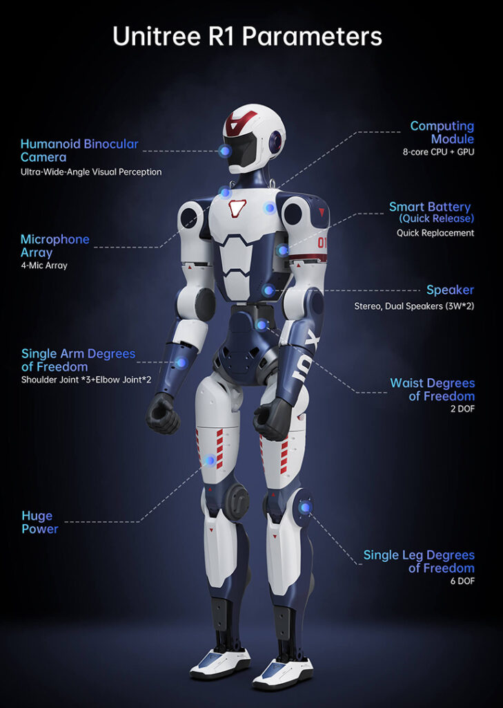

# Happy Baby R1

[](#)
[](#)
[](#)
[](#)

> **Confidentiality Notice:** Đây là dự án nội bộ của AiRA-Laboratory. Không chia sẻ mã nguồn, tài liệu, log vận hành, hình ảnh robot hoặc dữ liệu test ra bên ngoài khi chưa được phép.

## 1. Tổng quan

**Happy Baby R1** là workspace nghiên cứu, tích hợp và vận hành robot hình người **Unitree R1**. Baseline hiện tại của repo là **Ubuntu 20.04 LTS + ROS 2 Foxy + CycloneDDS**.

> **Lưu ý:** ROS 2 Foxy đã EOL. Baseline này được chọn để khớp máy Ubuntu 20.04 hiện tại. Nếu cần ROS 2 Humble, hãy dùng Ubuntu 22.04 hoặc container/VM riêng.



## 2. Stack kỹ thuật

| Nhóm | Công nghệ / cấu hình |
| :--- | :--- |
| Robot | Unitree R1 |
| Host OS | Ubuntu 20.04 LTS |
| Middleware | ROS 2 Foxy, CycloneDDS |
| Python | System Python 3.8 cho ROS 2, Conda env riêng cho AI/Simulation |
| Build | colcon, ament_cmake |
| Simulation hiện có | Python local simulator, UDP state/control simulator, Unitree MuJoCo policy runtime |
| Data / operation | rosbag2, test log, SOP vận hành |

## 3. Cấu trúc repo

```text
.
├── asset/                  # Hình ảnh minh họa, layout, specs
├── config/                 # Cấu hình network/DDS
├── data/                   # Datasets, models, processed data, rosbags, sim logs
├── docs/                   # Tài liệu vận hành, an toàn, hardware, architecture
├── media/                  # Video hoặc tư liệu demo
├── sim/                    # Mô phỏng state/control và policy runtime cục bộ
├── src/                    # ROS 2 packages thử nghiệm/tích hợp
├── test/                   # Script kiểm thử môi trường, DDS, SDK
└── README.md
```

Các thư mục `build/`, `install/`, `log/` là output cục bộ của ROS 2/colcon và không nên được dùng như nguồn tài liệu chính.

## 4. Quick Start

### 4.1. Cài môi trường

Tài liệu chính:

- [Ubuntu 20.04 setup guide](docs/operations/ubuntu_20_04_lts_setup_guide.md)
- [Development environment setup](docs/operations/development_environment_setup_guide.md)
- [Third-party build](docs/operations/third-party_build.md)
- [Unitree MuJoCo policy runtime](docs/operations/unitree_mujoco_policy_runtime.md)
- [Golden machine spec](docs/hardware/golden_machine_spec.md)

### 4.2. Build ROS 2 workspace

```bash
source /opt/ros/foxy/setup.bash
rosdep update
rosdep install --from-paths src --ignore-src -y --rosdistro foxy
colcon build --base-paths src --symlink-install --cmake-args -DCMAKE_BUILD_TYPE=Release
source install/setup.bash
```

### 4.3. Cấu hình DDS

```bash
export RMW_IMPLEMENTATION=rmw_cyclonedds_cpp
export CYCLONEDDS_URI=file://$PWD/config/cyclonedds_config.xml
```

Checklist liên quan:

- [Network setup checklist](docs/operations/network_setup_checklist.md)
- [Network static Ethernet](docs/operations/network_configuration_static_ethernet.md)
- [DDS implementation](docs/operations/dds_implementation.md)
- [Ubuntu 20.04/22.04 DDS compatibility test](docs/operations/practice/09_ubuntu_20_22_dds_compatibility_test.md)
- [Network/DDS rationale](docs/architecture/network_dds_rationale.md)

## 5. Chạy mô phỏng cục bộ

Chạy quỹ đạo mẫu:

```bash
python3 sim/robot_state_sim.py --mode path --hz 20 --steps 80
```

Chạy chế độ nhập lệnh:

```bash
python3 sim/robot_state_sim.py --mode keyboard
```

Mô phỏng state/control 2 terminal:

```bash
python3 sim/unitree_r1_robot_sim.py --duration 12
python3 sim/unitree_r1_controller_sim.py --duration 12
```

Chạy thử policy trong Unitree MuJoCo:

```bash
python3 scripts/run_unitree_mujoco_official_g1.py \
  --duration 20 \
  --interface lo \
  --auto-sim \
  --auto-passive-seconds 0.5 \
  --auto-fixstand-seconds 3.0 \
  --viewer
```

Quy ước hiện tại: `third_party/unitree_mujoco` giữ sạch theo upstream, `third_party/unitree_rl_mjlab` là nguồn policy ONNX/motion artifact của Unitree, còn script runtime local nằm trong `sim/unitree_mujoco_policy`; ONNX/motion symlink nằm trong `data/models/unitree_mujoco_policy`. Ưu tiên controller C++ chính thức của `unitree_rl_mjlab`; runner Python chỉ dùng để debug/log nhanh.

Tài liệu thực hành: [08_state_control_sim.md](docs/operations/practice/08_state_control_sim.md)

Tài liệu MuJoCo policy: [unitree_mujoco_policy_runtime.md](docs/operations/unitree_mujoco_policy_runtime.md)

## 6. Kiểm thử nhanh

```bash
source /opt/ros/foxy/setup.bash
source install/setup.bash
python3 test/test_dds_node.py
```

Kiểm tra môi trường AI hoặc SDK theo nhu cầu:

```bash
python3 test/test_ai_env.py
python3 test/test_unitree_dds_helloworld.py
```

## 7. Tài liệu chính

Điểm vào tài liệu: [docs/README.md](docs/README.md)

- Thành viên mới: [Practice index](docs/operations/practice/README.md)
- Người vận hành: [SOP_v0.md](docs/operations/SOP_v0.md), [Safety rules](docs/safety/safety_rules.md)
- Kỹ sư tích hợp: [Third-party build](docs/operations/third-party_build.md), [DDS implementation](docs/operations/dds_implementation.md)
- Kỹ sư mô phỏng: [Development environment setup](docs/operations/development_environment_setup_guide.md), [Unitree MuJoCo policy runtime](docs/operations/unitree_mujoco_policy_runtime.md), [rosbag2 operation](docs/operations/rosbag2_operation.md)

## 8. An toàn vận hành

Robot thật chỉ được vận hành khi đã thỏa các điều kiện an toàn:

1. Có người phụ trách nút Emergency Stop.
2. Không vận hành robot một mình.
3. Kiểm tra khu vực lab, nguồn điện, mạng, trạng thái robot và log trước khi chạy.
4. Chạy simulation hoặc dry-run trước khi chuyển lệnh sang hardware thật.
5. Ghi lại kết quả theo [test log template](docs/templates/test_log_template.md).

---

© 2026 AiRA-Laboratory. All Rights Reserved.
