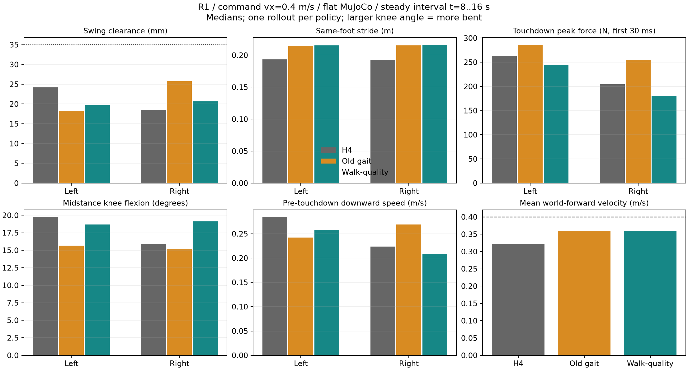
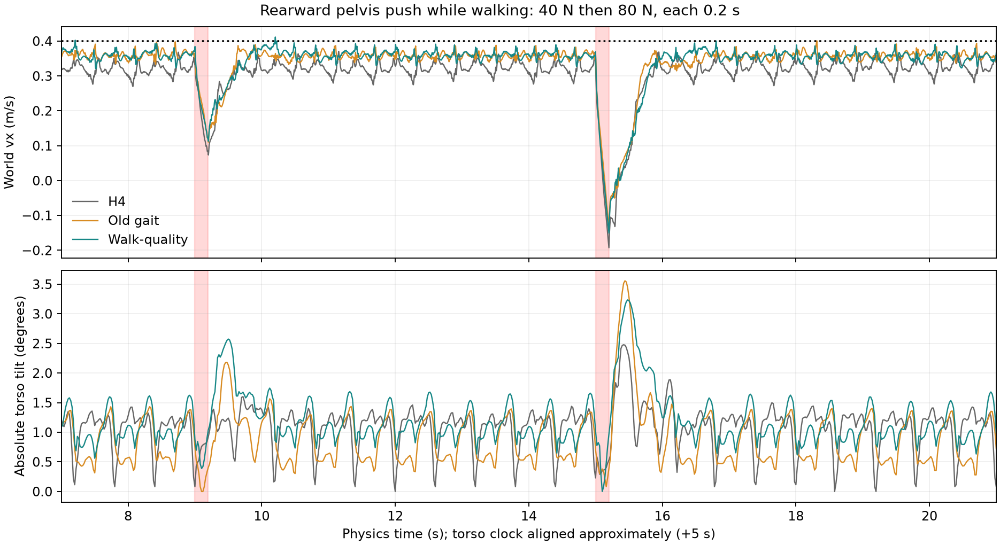

# So sánh gait walk-quality, gait cũ và H4 — 2026-09-09

## Kết luận về dáng đi

Hoàn thành **38/38 lượt autotest PASS**, gồm 14 lượt không đẩy và 24 lượt
ngoại lực với tổng 48 pulse được xác nhận trong log. Không ghi nhận fall guard.

Policy mới giảm lực đỉnh lúc tiếp đất và làm độ nhấc chân hai bên đều hơn ở
lệnh 0,4 m/s. Chưa cải thiện đáng kể chiều dài bước; gối pha trụ gập hơn gait
cũ. Vì vậy đây là cải thiện một phần, chưa đạt cả ba mục tiêu bước dài,
nhấc chân đủ cao và duỗi gối tự nhiên.

## Artifact đã xác minh

| Nhãn | ONNX dưới `policy/locomotion/flat_plus/` | Input | SHA-256 |
|---|---|---:|---|
| new | policy_flat_plus_gait_walkquality_v1.onnx | 335 | 7e573d4c738d7e0d1da63205342589ccbbcbe851001fd551fe5c35925c306007 |
| old | policy_flat_plus_gait_h4_v1.onnx | 335 | 6a4d259313697287c4858e707d08a0d5cdc5f9a2af4ed05b5c3d4a055abd5301 |
| h4 | policy_flat_plus_h4_v1.onnx | 332 | 3ec2bf9db2487667153c6c08d846d2762164aa959a0305030a6791c0596378f1 |

Ba model có cùng metadata default pose, PD gains và action scale. Gait cũ/mới
cùng contract `flat_plus_gait_h4_v1`; model mới khớp byte với
`results/gait_walkquality/policy.onnx`. Contract smoke C++ của model mới PASS.

Checkpoint mới: `iter=14999`, `common_step_counter=360000`, 2048 envs, seed 42,
24 steps/iteration, MLP 512/256/128. `train.yaml` ghi không warm-start/resume.
Theo schedule đã lưu: C0=0, C1=72000, C2=180000; run đã vượt mốc C2.
Đây là so sánh artifact của các run, chưa phải ablation kiểm soát mọi biến
training và nhiều seed.

Simulator hiện chọn model mới. Config HB vẫn chọn `policy_flat_plus_gait_h4_v1.onnx`
cũ. Không có deploy/restart service phần cứng trong lượt kiểm tra này.

## Phương pháp

- Chạy thật `simulate_cpp/build/run_policy` + `simulate/build/unitree_mujoco`,
  DDS loopback, Xvfb, một stack tại một thời điểm. Không dùng replay action offline.
- Nền phẳng `scene_slope_0.xml`; không dùng `scene.xml` có bậc thang.
  Khối lượng 28,931924 kg; timestep simulator 0,002 s, controller 50 Hz.
  Training lưu timestep 0,005 s và decimation 4, cũng 50 Hz.
- Baseline: warmup 5 s, command trong 12 s, zero command 6 s. Đo dáng đi
  ở clock physics 8–16 s để tránh tăng tốc/dừng. Policy/physics clock có
  lệch nhỏ do DDS; kiểm thời gian cuối các CSV trước diễn giải.
- Clearance = đỉnh site chân trong swing trừ median site height lúc contact,
  trên cùng mặt phẳng. Không đo từ ảnh/video.
- Stride = dịch chuyển theo X giữa hai touchdown liên tiếp của **cùng chân**.
  Khi đi thẳng đối xứng, mỗi bước luân phiên xấp xỉ nửa stride.
- Loại swing dưới 40 ms; nối contact gaps không quá 10 ms để tránh contact
  chatter. Lực touchdown = peak normal force tổng các foot collision geom
  trong 30 ms đầu touchdown. Đây không phải maximum force của cả rollout.
- Knee = góc gối trong đoạn 25–70% thời gian contact sau touchdown. Góc lớn
  hơn là gập hơn. Đây là midstance theo contact đo được, không đồng nhất tuyệt
  đối với mask phase trong reward training.
- Tilt báo cáo là góc tuyệt đối từ gravity, khác tilt tương đối mà autotest
  mặc định dùng. PASS của autotest không tự chứng minh chất lượng dáng đi.

## Kết quả đi 0,4 m/s

Trung vị theo từng chân trái/phải; mỗi lượt có khoảng 13 touchdown hợp lệ mỗi bên.

| Chỉ số | H4 | Gait cũ | Walk-quality mới |
|---|---:|---:|---:|
| Vx thực trung bình theo world X, m/s | 0,322 | 0,359 | 0,360 |
| Clearance trái/phải, mm | 24,2 / 18,5 | 18,3 / 25,8 | 19,7 / 20,7 |
| Stride trái/phải, m | 0,194 / 0,193 | 0,215 / 0,215 | 0,215 / 0,216 |
| Chu kỳ stride, s | 0,600 | 0,600 | 0,600 |
| Đỉnh lực touchdown trái/phải, N | 263 / 204 | 286 / 255 | 244 / 180 |
| Gối midstance trái/phải, độ | 19,8 / 15,9 | 15,7 / 15,1 | 18,7 / 19,1 |
| Tốc độ hạ trước touchdown trái/phải, m/s | 0,285 / 0,224 | 0,242 / 0,269 | 0,258 / 0,208 |
| Tilt tuyệt đối max toàn lượt, độ | 1,82 | 1,95 | 1,85 |
| Biên độ base Z đi đều, mm | 5,90 | 2,31 | 3,42 |

`metrics.json` là nguồn số chính xác.

So gait cũ, force peak giảm khoảng 15% bên trái và 29% bên phải. Tuy nhiên
clearance trung bình hai bên không tăng: chủ yếu giảm chênh lệch trái/phải.
Vận tốc hạ chân trái cũng chưa giảm, nên chưa thể gọi mọi mặt của tiếp đất
đều tốt hơn. Base Z dao động tăng so gait cũ; tilt vẫn thấp trong bài nền phẳng.

Nhịp 0,6 s được cả observation phase và contact reward củng cố. Tại Vx thực
0,36 m/s, stride xấp xỉ 0,216 m, mỗi bước luân phiên khoảng 0,108 m. Vì vậy
chỉ bổ sung reward nhấc chân không tự tạo được bước dài hơn ở cùng tốc độ.



Lặp lại độc lập bài 0,4 m/s cho hai gait: mới đạt Vx 0,359 m/s, clearance
20,0/20,6 mm, touchdown peak 247/181 N, gối 18,5/19,1°; cũ đạt Vx 0,360 m/s,
clearance 18,3/25,5 mm, touchdown peak 298/263 N, gối 15,8/15,1°.
Xu hướng giảm lực và tăng gập gối lặp lại ở cả hai lượt. Hai rollout chưa
đủ để suy ra độ tin cậy thống kê trên nhiều seed hoặc điều kiện môi trường.

## Tốc độ 0,6 m/s — trong dải train

Cả ba hoàn thành bài đi–dừng. Kết quả tiếp tục cho thấy giảm lực tiếp đất,
nhưng không phải tăng chiều cao nhấc chân hay duỗi gối:

| Chỉ số | H4 | Gait cũ | Gait mới |
|---|---:|---:|---:|
| Vx world trung bình, m/s | 0,527 | 0,572 | 0,550 |
| Clearance trái/phải, mm | 46,0 / 48,7 | 29,6 / 41,5 | 28,4 / 28,9 |
| Touchdown peak trái/phải, N | 275 / 244 | 410 / 324 | 274 / 239 |
| Midstance knee trái/phải, độ | 22,1 / 16,4 | 16,3 / 15,5 | 19,0 / 20,5 |
| Tilt max tuyệt đối, độ | 2,38 | 2,05 | 2,54 |

Gait mới giảm lực peak khoảng 33%/26% so gait cũ, đổi lại Vx giảm khoảng
0,022 m/s, clearance giảm và gối gập hơn. Peak chân mới ~29 mm vẫn thấp hơn
lower envelope 35 mm ở giữa swing trong cấu hình reward.

## Tốc độ 0,8 m/s — ngoài dải train gait

Saved config gait giới hạn `vx` trong [-0,6; 0,6] m/s. Lượt 0,8 m/s chỉ là
stress test, không dùng làm tiêu chí nghiệm thu trong dải đã train.

Gait mới: Vx 0,740 m/s, clearance khoảng 39/39 mm, lực touchdown 362/325 N,
tilt max 4,10°. Gait cũ: Vx 0,779 m/s, clearance 43/56 mm,
lực 456/379 N, tilt max 2,46°. Cả hai hoàn thành bài đi–dừng, nhưng kết quả
thể hiện đánh đổi tracking/nhấc chân/tilt với giảm force peak.

## Ngoại lực

Thử force tại COM body `pelvis`, hướng world ±X/±Y. Mỗi episode riêng cho một
policy, một trạng thái command (đứng hoặc đi 0,4 m/s), một hướng. Hai pulse
trong episode: 40 N tại t=9 s và 80 N tại t=15 s, mỗi pulse 0,2 s, tương ứng
8 và 16 N·s. Pulse thứ hai không phải trial độc lập; chưa quét mọi pha chân.

Đường force có unit test khối lượng 2 kg: kết quả vận tốc khớp xung lực,
đúng body indexing và không xoá external force vốn có. Force được thêm trước
mỗi `mj_step` và gỡ sau bước, opt-in bằng `MUJOCO_PUSH_SCHEDULE`.

Hoàn thành 24 episode, **48 pulse thực sự xuất hiện trong log**, 24/24 episode
autotest PASS, không fall guard. Mỗi policy qua 8/8 tình huống. Ngưỡng autotest
cho bài đẩy: relative tilt 45°, height drop 0,2 m, stand displacement 2 m;
giá trị đo thực tế dưới đây thấp hơn nhiều. Không dùng ngưỡng drift đứng mặc
định để coi dịch chuyển bắt buộc do lực đẩy là lỗi ngã.

| Trạng thái / hướng force world | H4: tilt max ° / recovery 80 N s | Gait cũ | Gait mới |
|---|---:|---:|---:|
| Đứng / +X | 3,53 / 0,874 | 3,67 / 0,842 | 3,39 / 0,936 |
| Đứng / -X | 6,98 / 0,826 | 5,95 / 0,846 | 6,01 / 1,078 |
| Đứng / +Y | 3,69 / 0,736 | 2,73 / 0,776 | 3,16 / 0,782 |
| Đứng / -Y | 3,34 / 0,852 | 2,56 / 0,796 | 2,03 / 0,780 |
| Đi 0,4 / +X | 2,47 / 0,922 | 1,75 / 1,018 | 2,59 / 1,044 |
| Đi 0,4 / -X | 2,48 / 0,998 | 3,56 / 0,920 | 3,24 / 1,020 |
| Đi 0,4 / +Y | 2,84 / 1,018 | 2,24 / 0,920 | 2,86 / 1,464 |
| Đi 0,4 / -Y | 3,24 / 1,296 | 4,23 / 1,142 | 3,54 / 1,208 |

Tilt lấy cả episode (cả hai pulse), recovery chỉ lấy sau pulse 80 N.
Gait mới chưa chứng minh chịu ngoại lực tốt hơn gait cũ; một số hướng giảm
tilt, một số hướng phục hồi vận tốc chậm hơn. Bài test chưa tìm force gây ngã.

Recovery vận tốc: sai số planar velocity so command <0,1 m/s trong liên tục
0,5 s. Lưu cả bản instantaneous và bản trung bình trượt nhân quả 0,6 s;
bản instantaneous có thể không đạt vì dao động vận tốc tự nhiên theo bước.
Table dùng bản trung bình, yêu cầu cửa sổ hoàn toàn sau pulse nên bao gồm ít
nhất 0,6 s trễ phép đo. Vận tốc so với hướng world của lệnh ban đầu; lệch
heading sau đẩy cũng ảnh hưởng metric. Số lẻ mili giây thể hiện phép tính
trên CSV 500 Hz, không hàm ý khả năng lặp lại chính xác đến mili giây.
Đây là recovery vận tốc, đánh giá cùng tilt/min-height và fall guard,
không coi riêng con số đó là toàn bộ khả năng hồi phục.



## Đối chiếu bài báo và training

Nguồn: [Gait-Conditioned RL with Multi-Phase Curriculum, v3](https://arxiv.org/pdf/2505.20619v3),
§III, Table I và Appendix Table III.

Đã vận dụng các ý chính: one-hot gait, reward phân theo mode, curriculum,
contact theo phase, nhấc chân và gối pha trụ. Bài báo còn có LSTM và các reward
phối hợp tay–chân, năng lượng tay, đối xứng/biên độ; bản đang chạy là MLP history.
R1 hiện có penalty động lượng toàn thân nhưng chưa thấy bộ phối hợp tay–chân
tường minh tương ứng trong saved reward config. Vì vậy đây là triển khai chọn
lọc ý tưởng; hiệu quả tự nhiên của dáng đi vẫn phải đo.

Saved `env.yaml` xác nhận bốn reward mới:

| Reward | Cấu hình chính | Điều đã đo |
|---|---|---|
| foot_clearance | -0,12; lower envelope đạt 35 mm giữa swing; cap 80 mm | Ở 0,4 m/s peak mới chỉ ~20 mm |
| swing_corridor | -0,08; half-width 15 mm, width 120–240 mm | Chưa có metric yaw-relative corridor đầy đủ |
| midstance_knee | -0,04; 0,08–0,25 rad | Midstance theo contact ~19°, vượt 14,3° |
| landing_velocity | -0,08; height <25 mm, down speed >0,25 m/s | Force peak giảm, down speed trái chưa giảm |

Các reward ramp trong 10.000 policy steps đã qua lâu tại checkpoint này.
Không thể giải thích kết quả hiện tại bằng việc run chưa tới ramp/C2.
Training còn có velocity pushes mỗi 5–6 s: XY ±0,5 m/s, Z ±0,4 m/s và
angular velocity perturbations. Phép thử force hữu hạn thời gian ở đây có
cơ chế khác nên cần đánh giá riêng.

Giả thuyết đáng kiểm tiếp: policy chấp nhận gập gối và nhấc chân thấp để giảm
chi phí khác/va đập. Chưa có reward contribution log hoặc controlled ablation
để kết luận chính xác weight nào gây ra đánh đổi. Không so trực tiếp weight
reward của paper với R1 khi công thức/normalization khác nhau.

## Hướng cải thiện có cơ sở từ số đo

1. Đặt acceptance rõ cho WALK chậm trong dải train: tracking, clearance từng
   chân, gối midstance và force/impulse touchdown cùng lúc. Giữ seed/checkpoint
   baseline để so thay đổi có kiểm soát.
2. Đo contribution và gate occupancy của clearance/knee; xác nhận phase/contact
   alignment trước điều chỉnh trọng số. Reward mới đang tồn tại nhưng mục tiêu
   hình học chưa đạt ở 0,4 m/s.
3. Muốn bước dài ở cùng tốc độ cần xét cadence/period và training tương ứng;
   không đổi period deploy của ONNX hiện tại để thử chữa dáng đi.
4. Nếu muốn gần paper hơn ở phần tay, thiết kế reward phối hợp tay–chân và
   rà posture tolerance của vai; kiểm cả thăng bằng và ngoại lực sau training.

## Tái lập

Tại root `Mujoco`, dùng môi trường Python có NumPy/Matplotlib:

```bash
cmake --build unitree_mujoco/simulate/build --target unitree_mujoco -j2
.venv/bin/python unitree_mujoco/simulate_cpp/tools/compare_gait_push.py
.venv/bin/python unitree_mujoco/simulate_cpp/tools/compare_gait_push.py --followup-only
.venv/bin/python unitree_mujoco/simulate_cpp/tools/summarize_gait_push.py
.venv/bin/python unitree_mujoco/simulate_cpp/tools/plot_gait_comparison.py
```

Runner giữ nguyên log đã hoàn thành khi chạy lại; muốn trial mới dùng tên/folder
mới, không ghi đè evidence. Raw `*.log`, `*.csv`, `*_physics.csv`, `*.push` và
`*.run.json` nằm cạnh báo cáo. Phép thử giới hạn ở nền phẳng, friction cố định,
các mức lực/trạng thái đã nêu; chưa xác định ngưỡng lực gây ngã hoặc độ bền
phần cứng.
